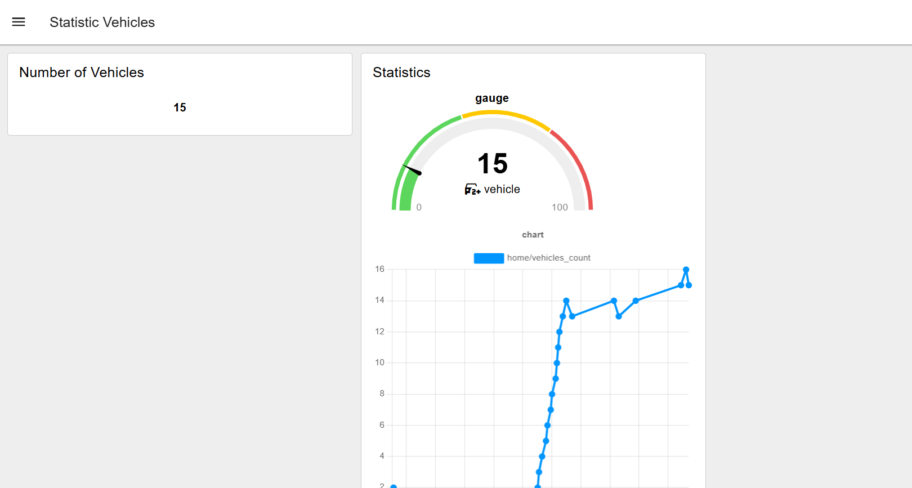

# HỆ THỐNG BÃI ĐỖ XE THÔNG MINH VÀ AN TOÀN

## Đặt bài toán
__Nhu cầu thực tế__

Trong các khu đô thị hiện đại, sự gia tăng nhanh chóng của phương tiện cá nhân khiến các bãi đỗ xe truyền thống trở nên quá tải và thiếu hiệu quả. Đồng thời, việc quản lý thủ công không chỉ tốn kém nhân lực mà còn dễ dẫn đến sai sót, mất an ninh và khó kiểm soát khi có sự cố xảy ra như cháy. Những vấn đề này đặt ra yêu cầu về một hệ thống bãi đỗ xe thông minh với đa dạng chức năng như:
- Quản lý tối ưu chỗ trống và số lượng xe: Giúp chủ bãi xe và người dùng dễ dàng xác định vị trí đỗ trống và sử dụng không gian hiệu quả.
- Tăng cường an toàn: Phát hiện và cảnh báo kịp thời các nguy cơ như cháy, khói, hoặc xe đỗ không đúng quy định.
- Tự động hóa và tiết kiệm chi phí vận hành: Giảm thiểu sự can thiệp của con người thông qua IoT.

__Cảm hứng cho đề tài__

Thực trạng cháy nổ tại các bãi xe: Các vụ cháy lớn tại các bãi đỗ xe trong hầm làm nổi bật nhu cầu về hệ thống phát hiện và xử lý cháy tự động.

Kinh nghiệm từ các thành phố lớn: Nhiều thành phố hiện đại đã triển khai bãi đỗ xe thông minh, nhưng chi phí đầu tư cao khiến các hệ thống này khó áp dụng rộng rãi tại Việt Nam. Việc xây dựng một mô hình đơn giản, chi phí thấp sẽ giúp tiếp cận được với các bãi xe nhỏ và vừa.

# Nội dung chính

1. Phần cứng
- Vi điều khiển: ESP32
- Cửa vào/ra: 
    + 2 x Servo SG90: Điều khiển đóng/mở ở 2 cửa
    + 2 x Cảm biến phát hiện vật cản: Phát hiện xe vào/ra
- Bãi đỗ xe:
    + 4 x Cảm biến siêu âm HC-SR04: Phát hiện trạng thái xe đỗ ở 4 vị trí
    + 2 x LDR: Điều khiển bật/tắt đèn dựa vào ánh sáng môi trường
- Hệ thống an toàn: 
    + 1 x DHT11: Theo dõi nhiệt độ, độ ẩm môi trường
    + 1 x MQ-2: Phát hiện khí gas, khói
    + 1 x Buzzer: Thông báo khi phát hiện nguy hiểm

2. Phần mềm
- Node-RED:
    + Hiển thị: Số lượng xe, trạng thái vị trí đỗ.
    + Quản lý: Thời gian đỗ xe, bật/tắt đèn, đóng/mở cổng.
    + Kiểm tra an toàn: Theo dõi nhiệt độ, độ ẩm, khí ga.
- MQTT Broker (EMQX)
- Platform.IO

3. Ý tưởng
- Cửa ra/vào: 
    + Cảm biến phát hiện vạt thể được sử dụng để phát hiện xe ra/vào, từ đó vi điều khiển sẽ kích hoạt servo sg90 mở/đóng
	+ Trên dashboard có thể kích hoạt mở/đóng servo sg90
- Bãi đỗ xe: 
    + 4 bãi đỗ xe <-> 4 cảm biến siêu âm HC-SR04 để kiểm tra vị trí trống/có xe
	+ Hiển thị trạng thái của từng vị trí trên dashboard: trống/có xe/ 
	+ Hiển thị thời gian đỗ xe
	+ LDR bật/tắt đèn khi trời tối/sáng; dashboard cũng có thể bật/tắt đèn
	+ Đo nhiệt độ, độ ẩm, khí ga của bãi đỗ xe + buzzer cảnh báo khi gặp nguy hiểm
	+ Hiển thị nhiệt độ, độ ẩm, khí ga lên dashboard

# Sơ đồ khối dự kiến
1. Sơ đồ khối

2. Lưu đồ thuật toán:
- Phần cửa ra/vào

-Phần bãi đỗ xe

# Mục tiêu của đề tài

Xây dựng một hệ thống bãi đỗ xe thông minh đáp ứng nhu cầu thực tế, bao gồm:
- Quản lý vị trí đỗ xe, số lượng xe và thời gian đỗ.
- Phát hiện cháy nổ hoặc sự cố bất thường (khói, nhiệt độ cao).
- Tự động hóa quá trình ra/vào bằng cảm biến và cửa servo.
- Tích hợp dashboard qua Node-RED để hiển thị và điều khiển.
- Chi phí thấp, dễ lắp đặt và triển khai.

## Project giữa kì
1. Mô hình:

2. Node-red edit

3. Node-red dashboard 2.0

4. Video demo: [Video youtube](https://www.youtube.com/shorts/EwfClbjN2_Q)
